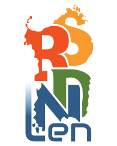
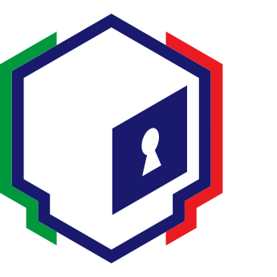

# Srdnlen CTF 2026 Quals

Srdnlen CTF 2026 Quals is the forth edition of the online Jeopardy-style Capture-The-Flag competition hosted by the members of [Srdnlen](https://srdnlen.it/), an italian team based in Sardinia, supported by the italian [Cybersecurity National Laboratory](https://cybersecnatlab.it/).

   

The competition marks the first round of the forth edition of [CyberCup](https://cybercup.it), an Italian CTF tournament.

## Challenges

| Category | Title                                                                             | Author                        | Dynamic            | Type  | Url                                | Port  |
| :------- | :-------------------------------------------------------------------------------- | :---------------------------- | :----------------: | ----: | ---------------------------------: | :---: |
| crypto   | [Faulty Mayo](crypto_faulty_mayo)                                                 | Davide Sechi <@guaddu>        | :heavy_check_mark: | tcp   | mayo.challs.srdnlen.it             | 1340  |
| crypto   | [FHAES](crypto_fhaes)                                                             | Lorenzo Siriu <@lrnzsir>      | :heavy_check_mark: | tcp   | fhaes.challs.srdnlen.it            | 1337  |
| crypto   | [Lightweight](crypto_lightweight)                                                 | Lorenzo Siriu <@lrnzsir>      | :heavy_check_mark: | tcp   | lightweight.challs.srdnlen.it      | 1338  |
| crypto   | [Threshold](crypto_threshold)                                                     | Lorenzo Siriu <@lrnzsir>      | :heavy_check_mark: | tcp   | threshold.challs.srdnlen.it        | 1339  |
| misc     | [The Trilogy of Death Volume I: Corel](misc_corel)                                | Davide Maiorca <@davezero>    | :x:                |       |                                    |       |
| misc     | [Emoji CAPTCHA](misc_emoji_captcha)                                               | Nicholas Meli <@uNickz>       | :heavy_check_mark: | tcp   | emoji.challs.srdnlen.it            | 1717  |
| misc     | [The Trilogy of Death Volume II: The Legendary Armory](misc_the_legendary_armory) | Davide Maiorca <@davezero>    | :x:                |       |                                    |       |
| misc     | [The Trilogy of Death Volume III: The Poisoned Apple](misc_the_poisoned_apple)    | Davide Maiorca <@davezero>    | :x:                |       |                                    |       |
| pwn      | [Common offset](pwn_common_offset)                                                | Matteo Chiesa <@church>       | :heavy_check_mark: | tcp   | common-offset.challs.srdnlen.it    | 1089  |
| pwn      | [Echo](pwn_echo)                                                                  | Matteo Chiesa <@church>       | :heavy_check_mark: | tcp   | echo.challs.srdnlen.it             | 1091  |
| pwn      | [Linx](pwn_linx)                                                                  | Diego Oliva <@doliv>          | :heavy_check_mark: | tcp   | linx.challs.srdnlen.it             | 1092  |
| pwn      | [Registered Stack](pwn_registered_stack)                                          | Matteo Chiesa <@church>       | :heavy_check_mark: | tcp   | registered-stack.challs.srdnlen.it | 1090  |
| rev      | [Artistic warmup](rev_artistic_warmup)                                            | Simone Sulis <@salsa>         | :x:                |       |                                    |       |
| rev      | [Cornflake v3.5](rev_cornflake_v3-5)                                              | Simone Sulis <@salsa>         | :heavy_check_mark: | tcp   | cornflake.challs.srdnlen.it        | 8000  |
| rev      | [Dante's Trial](rev_dantes_trial)                                                 | Daniele Orrù <@Den1211>       | :x:                |       |                                    |       |
| rev      | [Rev Juice](rev_juice)                                                            | Tommaso Casti <@T0mm1>        | :x:                |       |                                    |       |
| web      | [After Image](web_afterimage)                                                     | Matteo Sanna <@sanmatte>      | :heavy_check_mark: | http  | afterimage.challs.srdnlen.it       | 80    |
| web      | [Double Shop](web_doubleshop)                                                     | Mirko Angius <@inn3r>         | :heavy_check_mark: | http  | doubleshop.challs.srdnlen.it       | 80    |
| web      | [MSN Revive](web_msn_revive)                                                      | Christian Scano <@d4rkkn1gh7> | :heavy_check_mark: | http  | msnrevive.challs.srdnlen.it        | 80    |
| web      | [TodoList](web_todolist)                                                          | Lorenzo Pisu <@pysu>          | :heavy_check_mark: | http  | todolist.challs.srdnlen.it         | 80    |
