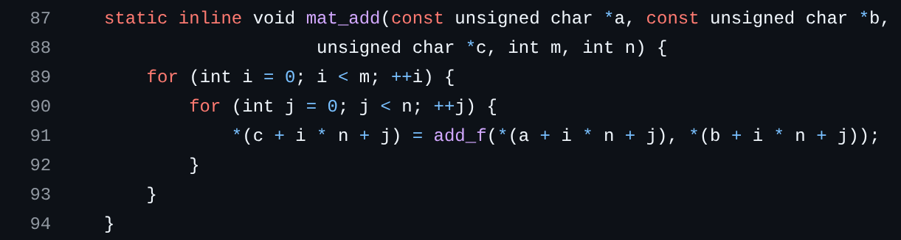

# Faulty Mayo

- **Category:** Crypto
- **Solves:** 58
- **Tag:** Post Quantum, Fault Injection

## Description

MAYO is completely secure, so even with a small fault it won't matter...

_source code for MAYO is taken straight from [here](https://github.com/PQCMayo/MAYO-C), I only changed some compilation flags_

## Details

The server lets you edit the value of a nibble in a limited portion of the binary that generates a signature for a random message, then runs said patched binary printing the generated signature. Alternatively the server asks for a valid signature of a randomly generated message, and prints the flag if the signature is valid.

## Solution

The core idea is to leak the i-th element of one `Ox` vector for `o` signatures, and then solve a linear system to recover the i-th row of `O`, since the value of `x` is known, repeating the process for every row; because of how the binary is compiled you can actually leak an element from each of the `Ox` used in a signature, optimizing the leaking process to need only $\Large\frac{o}{k}$ queries per row

The first thing to do is figuring out what the editable portion of the binary does, this can be done by simply getting the value of the bytes in that range, for example using python, and then putting them into an online disassembler, getting the following output (some parts omitted since they are repetitive):

```
0:      bb 00 00 00 00          mov    ebx,0x0
5:      8d 48 ff                lea    ecx,[rax-0x1]
8:      48 89 8d 88 5e f1 ff    mov    QWORD PTR [rbp-0xea178],rcx
f:      83 e0 3f                and    eax,0x3f
12:     0f 84 51 08 00 00       je     0x869
18:     48 83 f8 01             cmp    rax,0x1
1c:     0f 84 1f 08 00 00       je     0x841
...
26e:    48 83 f8 3e             cmp    rax,0x3e
272:    74 15                   je     0x289
274:    41 0f b6 37             movzx  esi,BYTE PTR [r15]
278:    41 0f b6 3e             movzx  edi,BYTE PTR [r14]
27c:    e8 1d bf ff ff          call   0xffffffffffffc19e
281:    41 88 45 00             mov    BYTE PTR [r13+0x0],al
285:    48 83 c3 01             add    rbx,0x1
289:    42 0f b6 34 3b          movzx  esi,BYTE PTR [rbx+r15*1]
28e:    41 0f b6 3c 1e          movzx  edi,BYTE PTR [r14+rbx*1]
293:    e8 06 bf ff ff          call   0xffffffffffffc19e
298:    41 88 44 1d 00          mov    BYTE PTR [r13+rbx*1+0x0],al
29d:    48 83 c3 01             add    rbx,0x1
...
841:    42 0f b6 34 3b          movzx  esi,BYTE PTR [rbx+r15*1]
846:    41 0f b6 3c 1e          movzx  edi,BYTE PTR [r14+rbx*1]
84b:    e8 4e b9 ff ff          call   0xffffffffffffc19e
850:    41 88 44 1d 00          mov    BYTE PTR [r13+rbx*1+0x0],al
855:    48 89 d8                mov    rax,rbx
858:    48 83 c3 01             add    rbx,0x1
85c:    48 3b 85 88 5e f1 ff    cmp    rax,QWORD PTR [rbp-0xea178]
863:    0f 84 9a 05 00 00       je     0xe03
869:    42 0f b6 34 3b          movzx  esi,BYTE PTR [rbx+r15*1]
86e:    41 0f b6 3c 1e          movzx  edi,BYTE PTR [r14+rbx*1]
873:    e8 26 b9 ff ff          call   0xffffffffffffc19e
878:    41 88 44 1d 00          mov    BYTE PTR [r13+rbx*1+0x0],al
87d:    4c 8d 63 01             lea    r12,[rbx+0x1]
881:    43 0f b6 34 27          movzx  esi,BYTE PTR [r15+r12*1]
886:    43 0f b6 3c 26          movzx  edi,BYTE PTR [r14+r12*1]
88b:    e8 0e b9 ff ff          call   0xffffffffffffc19e
890:    43 88 44 25 00          mov    BYTE PTR [r13+r12*1+0x0],al
895:    43 0f b6 74 27 01       movzx  esi,BYTE PTR [r15+r12*1+0x1]
89b:    43 0f b6 7c 26 01       movzx  edi,BYTE PTR [r14+r12*1+0x1]
8a1:    e8 f8 b8 ff ff          call   0xffffffffffffc19e
8a6:    43 88 44 25 01          mov    BYTE PTR [r13+r12*1+0x1],al
...
dbd:    43 0f b6 74 27 3d       movzx  esi,BYTE PTR [r15+r12*1+0x3d]
dc3:    43 0f b6 7c 26 3d       movzx  edi,BYTE PTR [r14+r12*1+0x3d]
dc9:    e8 d0 b3 ff ff          call   0xffffffffffffc19e
dce:    43 88 44 25 3d          mov    BYTE PTR [r13+r12*1+0x3d],al
dd3:    49 8d 5c 24 3e          lea    rbx,[r12+0x3e]
dd8:    43 0f b6 74 27 3e       movzx  esi,BYTE PTR [r15+r12*1+0x3e]
dde:    43 0f b6 7c 26 3e       movzx  edi,BYTE PTR [r14+r12*1+0x3e]
de4:    e8 b5 b3 ff ff          call   0xffffffffffffc19e
de9:    43 88 44 25 3e          mov    BYTE PTR [r13+r12*1+0x3e],al
dee:    48 89 d8                mov    rax,rbx
df1:    49 8d 5c 24 3f          lea    rbx,[r12+0x3f]
```

It's clear by the structure of the assembly that this is a loop that was unrolled by the compiler, and opening the binary with a decompiler like Ghidra you can see that this is the inner loop of the `mat_add` function



Since the loop was unrolled it's not possible to make each one of its iterations behave differently, but just one, let's analyze the assembly above further to figure out how

Because the value of `eax` (aka the value of `n`) is `0x3f` the code jumps directly to `869` so you can ignore the instructions before that

Editing one of the parameters of `add_f` (`0xffffffffffffc19e`) proves difficult and depends totally on values you can't control, from registers and memory, so it's better to just change the register from which the return value is taken, specifically since `add_f` doesn't modify `rsi`, that contains the element of `Ox`, the intuitive choice is taking its value instead of that from `al`, and because these elements' values are less than `16` (MAYO works in `GF(2**4)`) the least significative byte is enough

Trying this patch you can see that it takes just a nibble to do it

```
0:  41 88 44 1d 00          mov    BYTE PTR [r13+rbx*1+0x0],al
5:  43 88 44 25 00          mov    BYTE PTR [r13+r12*1+0x0],al
a:  90                      nop
b:  41 88 74 1d 00          mov    BYTE PTR [r13+rbx*1+0x0],sil
10: 43 88 74 25 00          mov    BYTE PTR [r13+r12*1+0x0],sil
```

Now that you have the leak you just need to understand how to build the linear system

given

```
α[i] = leak of the i-th element of Ox
x[i] = x used to calculate Ox corresponding to α[i]
all x[i] are linearly independent
```

and knowing

$$
\begin{pmatrix} O[i][0] & O[i][1] & \cdots & O[i][o-1] \end{pmatrix}
\cdot
\begin{bmatrix}
x[0][0] & x[1][0] & \cdots & x[o-1][0] \\
x[0][1] & x[1][1] & \cdots & x[o-1][1] \\
\vdots & \vdots & & \vdots \\
x[0][o-1] & x[1][o-1] & \cdots & x[o-1][o-1]
\end{bmatrix} = \begin{pmatrix} α[0] & α[1] & \cdots & α[o-1] \end{pmatrix}
$$

the value of `O`'s row can be found like this

$$
\begin{pmatrix} O[i][0] & O[i][1] & \cdots & O[i][o-1] \end{pmatrix} =
\begin{pmatrix} α[0] & α[1] & \cdots & α[o-1] \end{pmatrix}
\cdot
\begin{bmatrix}
x[0][0] & x[1][0] & \cdots & x[o-1][0] \\
x[0][1] & x[1][1] & \cdots & x[o-1][1] \\
\vdots & \vdots & & \vdots \\
x[0][o-1] & x[1][o-1] & \cdots & x[o-1][o-1]
\end{bmatrix}^{-1}
$$

then this process is repeated for every row of `O`, fully recovering the base of the secret oil space

since you don't really care about `seed_sk` and since `P1` and `P2` are in the public key too, this is all you need to sign, to avoid reimplementing MAYO you can just write this part in C, using [the same library that was used to build the challenge](https://github.com/PQCMayo/MAYO-C), that was linked in the description, and then run the binary from python

this is the full code for the solve:

solve.py:
```py
from sage.all import ZZ, GF, vector, Matrix
import ast
import tqdm
from functools import reduce
from pwn import connect, process, context

context.log_level = "CRITICAL"

MAYO_SCHEME = "MAYO-2"
n = 81
m = 64
o = 17
k = 4
q = 16

distance1 = 24
distance2 = 22
distance3 = 27
with open("chall", "rb") as f:
    chall_binary = f.read()
assert chall_binary.count(bytes.fromhex("0f849a050000")) == 1
base = chall_binary.index(bytes.fromhex("0f849a050000"))+23

pk_ok = False
Fq = GF(q, "z")
O = Matrix(ZZ, m, o)

for i in tqdm.trange(m):
    a = vector(Fq, o)
    X = Matrix(Fq, o, o)
    t = 0
    while t < o:
        io = connect("mayo.challs.srdnlen.it", 1340)

        io.sendline(b"1")
        io.sendline(str(base+(distance1 if i > 0 else 0)+max(min(i, m-2)-1, 0)*distance2+(distance3 if i == m-1 else 0)).encode())
        io.sendline(b"0")
        io.sendline(b"7")

        io.recvuntil(b"with code: ")
        code = int(io.recvline(False).decode())

        io.recvuntil(b"output: ")
        output = ast.literal_eval(io.recvline(False).decode()).decode()

        io.close()

        if not pk_ok:
            pk_ok = True
            pk = output.split("pk: ")[1].split("\n")[0]
            with open("pk.bin", "wb") as f:
                f.write(bytes.fromhex(pk))
        sm = output.split("sm: ")[1].split("\n")[0]

        dec_s = bytes.fromhex("".join(["0"+sm[j+1]+"0"+sm[j] for j in range(0, k*n, 2)]))

        for j in range(0, k*n, n):
            x = vector(Fq, [Fq.from_integer(el) for el in dec_s[j+m:j+n]])
            prev_rank = X.rank()
            X[:, t] = x
            if X.rank() == prev_rank:
                continue
            alpha = dec_s[j+i]
            a[t] = Fq.from_integer(alpha)
            t += 1
            if t == o:
                break

    inv_X = X.inverse()
    tmp = a*inv_X
    O[i, :] = vector(ZZ, [el.to_integer() for el in tmp])

O_bytes = bytes(reduce(lambda x,y: x+y, [list(map(int, sub)) for sub in O]))

with open("O.bin", "wb") as f:
    f.write(O_bytes)

io = connect("mayo.challs.srdnlen.it", 1340)

io.sendline(b"2")

io.recvuntil(b"for the message \"")
msg = io.recvuntil(b"\"", drop=True)

solve = process(["./sign", MAYO_SCHEME, msg])

res = solve.recvline(False).decode()

if res != "signature was successful!":
    print(res)
    quit()

sig = solve.recvline(False).decode()

solve.close()

io.sendline(sig.encode())

io.interactive()
```

sign.c:
```c
#include <stdio.h>
#include <stdlib.h>
#include <string.h>
#include <ctype.h>
#include <randombytes.h>
#include <mayo.h>
#include <fips202.h>
#include <arithmetic.h>
#include <simple_arithmetic.h>
#include <stdalign.h>

static void print_hex(const unsigned char *hex, int len) {
    for (int i = 0; i < len;  ++i) {
        printf("%02x", hex[i]);
    }
    printf("\n");
}

#define MAYO_MIN(x, y) (((x) < (y)) ? (x) : (y))
#define PK_PRF AES_128_CTR

static void decode(const unsigned char *m, unsigned char *mdec, int mdeclen) {
    int i;
    for (i = 0; i < mdeclen / 2; ++i) {
        *mdec++ = m[i] & 0xf;
        *mdec++ = m[i] >> 4;
    }

    if (mdeclen % 2 == 1) {
        *mdec++ = m[i] & 0x0f;
    }
}

static void encode(const unsigned char *m, unsigned char *menc, int mlen) {
    int i;
    for (i = 0; i < mlen / 2; ++i, m += 2) {
        menc[i] = (*m) | (*(m + 1) << 4);
    }

    if (mlen % 2 == 1) {
        menc[i] = (*m);
    }
}

static void compute_rhs(const mayo_params_t *p, uint64_t *vPv, const unsigned char *t, unsigned char *y){
    #ifndef ENABLE_PARAMS_DYNAMIC
    (void) p;
    #endif

    const size_t top_pos = ((PARAM_m(p) - 1) % 16) * 4;
    const size_t m_vec_limbs = PARAM_m_vec_limbs(p);

    // zero out tails of m_vecs if neccesary
    if(PARAM_m(p) % 16 != 0){
        uint64_t mask = 1;
        mask <<= ((PARAM_m(p) % 16)*4);
        mask -= 1;
        for (int i = 0; i < PARAM_k(p)*PARAM_k(p); i++)
        {
            vPv[i*m_vec_limbs + m_vec_limbs - 1] &= mask;
        }
    }

    uint64_t temp[M_VEC_LIMBS_MAX] = {0};
    unsigned char *temp_bytes = (unsigned char *) temp;
    for (int i = PARAM_k(p) - 1; i >= 0 ; i--) {
        for (int j = i; j < PARAM_k(p); j++) {
            // multiply by X (shift up 4 bits)
            unsigned char top = (temp[m_vec_limbs-1] >> top_pos) % 16;
            temp[m_vec_limbs-1] <<= 4;
            for(int k = m_vec_limbs - 2; k>=0; k--){
                temp[k+1] ^= temp[k] >> 60;
                temp[k] <<= 4;
            }
            // reduce mod f(X)
            for (int jj = 0; jj < F_TAIL_LEN; jj++) {
                if(jj%2 == 0){
#ifdef TARGET_BIG_ENDIAN
                    temp_bytes[(((jj/2 + 8) / 8) * 8) - 1 - (jj/2)%8] ^= mul_f(top, PARAM_f_tail(p)[jj]);
#else
                    temp_bytes[jj/2] ^= mul_f(top, PARAM_f_tail(p)[jj]);
#endif
                }
                else {
#ifdef TARGET_BIG_ENDIAN
                    temp_bytes[(((jj/2 + 8) / 8) * 8) - 1 - (jj/2)%8] ^= mul_f(top, PARAM_f_tail(p)[jj]) << 4;
#else
                    temp_bytes[jj/2] ^= mul_f(top, PARAM_f_tail(p)[jj]) << 4;
#endif
                }
            }

            // extract from vPv and add
            for(size_t k=0; k < m_vec_limbs; k ++){
                temp[k] ^= vPv[( i * PARAM_k(p) + j )* m_vec_limbs + k] ^ ((i!=j)*vPv[( j * PARAM_k(p) + i )* m_vec_limbs + k]);
            }
        }
    }

    // compute y
    for (int i = 0; i < PARAM_m(p); i+=2)
    {
#ifdef TARGET_BIG_ENDIAN
        y[i]   = t[i]   ^ (temp_bytes[(((i/2 + 8) / 8) * 8) - 1 - (i/2)%8] & 0xF);
        y[i+1] = t[i+1] ^ (temp_bytes[(((i/2 + 8) / 8) * 8) - 1 - (i/2)%8] >> 4);
#else
        y[i]   = t[i]   ^ (temp_bytes[i/2] & 0xF);
        y[i+1] = t[i+1] ^ (temp_bytes[i/2] >> 4);
#endif
    }
}

static void transpose_16x16_nibbles(uint64_t *M){
    static const uint64_t even_nibbles = 0x0f0f0f0f0f0f0f0f;
    static const uint64_t even_bytes   = 0x00ff00ff00ff00ff;
    static const uint64_t even_2bytes  = 0x0000ffff0000ffff;
    static const uint64_t even_half    = 0x00000000ffffffff;

    for (size_t i = 0; i < 16; i+=2)
    {
        uint64_t t = ((M[i] >> 4 ) ^ M[i+1]) & even_nibbles;
        M[i  ] ^= t << 4;
        M[i+1] ^= t;
    }

    for (size_t i = 0; i < 16; i+=4)
    {
        uint64_t t0 = ((M[i  ] >> 8) ^ M[i+2]) & even_bytes;
        uint64_t t1 = ((M[i+1] >> 8) ^ M[i+3]) & even_bytes;
        M[i  ] ^= (t0 << 8);
        M[i+1] ^= (t1 << 8);
        M[i+2] ^= t0;
        M[i+3] ^= t1;
    }

    for (size_t i = 0; i < 4; i++)
    {
        uint64_t t0 = ((M[i  ] >> 16) ^ M[i+ 4]) & even_2bytes;
        uint64_t t1 = ((M[i+8] >> 16) ^ M[i+12]) & even_2bytes;

        M[i   ] ^= t0 << 16;
        M[i+ 8] ^= t1 << 16;
        M[i+ 4] ^= t0;
        M[i+12] ^= t1;
    }

    for (size_t i = 0; i < 8; i++)
    {
        uint64_t t = ((M[i]>>32) ^ M[i+8]) & even_half;
        M[i  ] ^= t << 32;
        M[i+8] ^= t;
    }
}

#define MAYO_M_OVER_8 ((M_MAX + 7) / 8)
static void compute_A(const mayo_params_t *p, uint64_t *VtL, unsigned char *A_out) {
    #ifndef ENABLE_PARAMS_DYNAMIC
    (void) p;
    #endif

    int bits_to_shift = 0;
    int words_to_shift = 0;
    const int m_vec_limbs = PARAM_m_vec_limbs(p);
    uint64_t A[(((O_MAX*K_MAX+15)/16)*16)*MAYO_M_OVER_8] = {0};
    size_t A_width = ((PARAM_o(p)*PARAM_k(p) + 15)/16)*16;
    const uint64_t *Mi, *Mj;

    // zero out tails of m_vecs if neccesary
    if(PARAM_m(p) % 16 != 0){
        uint64_t mask = 1;
        mask <<= (PARAM_m(p) % 16)*4;
        mask -= 1;
        for (int i = 0; i < PARAM_o(p)*PARAM_k(p); i++)
        {
            VtL[i*m_vec_limbs + m_vec_limbs - 1] &= mask;
        }
    }

    for (int i = 0; i <= PARAM_k(p) - 1; ++i) {
        for (int j = PARAM_k(p) - 1; j >= i; --j) {
            // add the M_i and M_j to A, shifted "down" by l positions
            Mj = VtL + j * m_vec_limbs * PARAM_o(p);
            for (int c = 0; c < PARAM_o(p); c++) {
                for (int k = 0; k < m_vec_limbs; k++)
                {
                    A[ PARAM_o(p) * i + c + (k + words_to_shift)*A_width] ^= Mj[k + c*m_vec_limbs] << bits_to_shift;
                    if(bits_to_shift > 0){
                        A[ PARAM_o(p) * i + c + (k + words_to_shift + 1)*A_width] ^= Mj[k + c*m_vec_limbs] >> (64-bits_to_shift);
                    }
                }
            }

            if (i != j) {
                Mi = VtL + i * m_vec_limbs * PARAM_o(p);
                for (int c = 0; c < PARAM_o(p); c++) {
                    for (int k = 0; k < m_vec_limbs; k++)
                    {
                        A[PARAM_o(p) * j + c + (k + words_to_shift)*A_width] ^= Mi[k + c*m_vec_limbs] << bits_to_shift;
                        if(bits_to_shift > 0){
                            A[PARAM_o(p) * j + c + (k + words_to_shift + 1)*A_width] ^= Mi[k + c*m_vec_limbs] >> (64-bits_to_shift);
                        }
                    }
                }
            }

            bits_to_shift += 4;
            if(bits_to_shift == 64){
                words_to_shift ++;
                bits_to_shift = 0;
            }
        }
    }

    for (size_t c = 0; c < A_width*((PARAM_m(p) + (PARAM_k(p)+1)*PARAM_k(p)/2 +15)/16) ; c+= 16)
    {
        transpose_16x16_nibbles(A + c);
    }

    unsigned char tab[F_TAIL_LEN*4] = {0};
    for (size_t i = 0; i < F_TAIL_LEN; i++)
    {
        tab[4*i]   = mul_f(PARAM_f_tail(p)[i],1);
        tab[4*i+1] = mul_f(PARAM_f_tail(p)[i],2);
        tab[4*i+2] = mul_f(PARAM_f_tail(p)[i],4);
        tab[4*i+3] = mul_f(PARAM_f_tail(p)[i],8);
    }

    uint64_t low_bit_in_nibble = 0x1111111111111111;

    for (size_t c = 0; c < A_width; c+= 16)
    {
        for (int r = PARAM_m(p); r < PARAM_m(p) + (PARAM_k(p)+1)*PARAM_k(p)/2 ; r++)
        {
            size_t pos = (r/16)*A_width + c + (r%16);
            uint64_t t0 =  A[pos]       & low_bit_in_nibble;
            uint64_t t1 = (A[pos] >> 1) & low_bit_in_nibble;
            uint64_t t2 = (A[pos] >> 2) & low_bit_in_nibble;
            uint64_t t3 = (A[pos] >> 3) & low_bit_in_nibble;
            for (size_t t = 0; t < F_TAIL_LEN; t++)
            {
                A[((r+t-PARAM_m(p))/16)*A_width + c + ((r+t-PARAM_m(p))%16)] ^= t0*tab[4*t+0] ^ t1*tab[4*t+1] ^ t2*tab[4*t+2] ^ t3*tab[4*t+3];
            }
        }
    }

#ifdef TARGET_BIG_ENDIAN
    for (int i = 0; i < (((PARAM_o(p)*PARAM_k(p)+15)/16)*16)*MAYO_M_OVER_8; ++i) 
        A[i] = BSWAP64(A[i]);
#endif


    for (int r = 0; r < PARAM_m(p); r+=16)
    {
        for (int c = 0; c < PARAM_A_cols(p)-1 ; c+=16)
        {
            for (int i = 0; i + r < PARAM_m(p); i++)
            {
                decode( (unsigned char *) &A[r*A_width/16 + c + i], A_out + PARAM_A_cols(p)*(r+i) + c, MAYO_MIN(16, PARAM_A_cols(p)-1-c));
            }
        }
    }
}

int sign_signature(const mayo_params_t *p, unsigned char *sig,
              size_t *siglen, const unsigned char *m,
              size_t mlen, uint8_t* O, uint64_t* pk) {
    int ret = MAYO_OK;
    unsigned char tenc[M_BYTES_MAX], t[M_MAX]; // no secret data
    unsigned char y[M_MAX];                    // secret data
    unsigned char salt[SALT_BYTES_MAX];        // not secret data
    unsigned char V[K_MAX * V_BYTES_MAX + R_BYTES_MAX], Vdec[V_MAX * K_MAX];                 // secret data
    unsigned char A[((M_MAX+7)/8*8) * (K_MAX * O_MAX + 1)] = { 0 };   // secret data
    unsigned char x[K_MAX * N_MAX];                       // not secret data
    unsigned char r[K_MAX * O_MAX + 1] = { 0 };           // secret data
    unsigned char s[K_MAX * N_MAX];                       // not secret data
    unsigned char seed_sk[CSK_BYTES_MAX];
    unsigned char Ox[V_MAX];        // secret data
    unsigned char tmp[DIGEST_BYTES_MAX + SALT_BYTES_MAX + SK_SEED_BYTES_MAX + 1];
    unsigned char *ctrbyte;
    unsigned char *vi;

    const int param_m = PARAM_m(p);
    const int param_n = PARAM_n(p);
    const int param_o = PARAM_o(p);
    const int param_k = PARAM_k(p);
    const int param_v = PARAM_v(p);
    const int param_m_bytes = PARAM_m_bytes(p);
    const int param_v_bytes = PARAM_v_bytes(p);
    const int param_r_bytes = PARAM_r_bytes(p);
    const int param_sig_bytes = PARAM_sig_bytes(p);
    const int param_A_cols = PARAM_A_cols(p);
    const int param_digest_bytes = PARAM_digest_bytes(p);
    const int param_sk_seed_bytes = PARAM_sk_seed_bytes(p);
    const int param_salt_bytes = PARAM_salt_bytes(p);

    if (randombytes(seed_sk, PARAM_sk_seed_bytes(p)) != MAYO_OK) {
        ret = MAYO_ERR;
        goto err;
    }


    // hash message
    shake256(tmp, param_digest_bytes, m, mlen);

    uint64_t *P1 = pk;
    uint64_t *P2 = pk + PARAM_P1_limbs(p);
    uint64_t *L = P2;
    P1P1t_times_O(p, P1, O, L);
    uint64_t Mtmp[K_MAX * O_MAX * M_VEC_LIMBS_MAX] = {0};

#ifdef TARGET_BIG_ENDIAN
    for (int i = 0; i < PARAM_P1_limbs(p); ++i) {
        P1[i] = BSWAP64(P1[i]);
    }
    for (int i = 0; i < PARAM_P2_limbs(p); ++i) {
        L[i] = BSWAP64(L[i]);
    }
#endif

    // choose the randomizer
    #if defined(PQM4) || defined(HAVE_RANDOMBYTES_NORETVAL)
    randombytes(tmp + param_digest_bytes, param_salt_bytes);
    #else
    if (randombytes(tmp + param_digest_bytes, param_salt_bytes) != MAYO_OK) {
        ret = MAYO_ERR;
        goto err;
    }
    #endif

    // hashing to salt
    memcpy(tmp + param_digest_bytes + param_salt_bytes, seed_sk,
           param_sk_seed_bytes);
    shake256(salt, param_salt_bytes, tmp,
             param_digest_bytes + param_salt_bytes + param_sk_seed_bytes);

#ifdef ENABLE_CT_TESTING
    VALGRIND_MAKE_MEM_DEFINED(salt, SALT_BYTES_MAX); // Salt is not secret
#endif

    // hashing to t
    memcpy(tmp + param_digest_bytes, salt, param_salt_bytes);
    ctrbyte = tmp + param_digest_bytes + param_salt_bytes + param_sk_seed_bytes;

    shake256(tenc, param_m_bytes, tmp, param_digest_bytes + param_salt_bytes);

    decode(tenc, t, param_m); // may not be necessary

    for (int ctr = 0; ctr <= 255; ++ctr) {
        *ctrbyte = (unsigned char)ctr;

        shake256(V, param_k * param_v_bytes + param_r_bytes, tmp,
                 param_digest_bytes + param_salt_bytes + param_sk_seed_bytes + 1);

        // decode the v_i vectors
        for (int i = 0; i <= param_k - 1; ++i) {
            decode(V + i * param_v_bytes, Vdec + i * param_v, param_v);
        }

        // compute M_i matrices and all v_i*P1*v_j
        compute_M_and_VPV(p, Vdec, L, P1, Mtmp, (uint64_t*) A);

        compute_rhs(p, (uint64_t*) A, t, y);
        compute_A(p, Mtmp, A);

        for (int i = 0; i < param_m; i++)
        {
            A[(1+i)*(param_k*param_o + 1) - 1] = 0;
        }

        decode(V + param_k * param_v_bytes, r,
               param_k *
               param_o);

        if (sample_solution(p, A, y, r, x, param_k, param_o, param_m, param_A_cols)) {
            break;
        } else {
            memset(Mtmp, 0, sizeof(Mtmp));
            memset(A, 0, sizeof(A));
        }
    }

    for (int i = 0; i <= param_k - 1; ++i) {
        vi = Vdec + i * (param_n - param_o);
        mat_mul(O, x + i * param_o, Ox, param_o, param_n - param_o, 1);
        mat_add(vi, Ox, s + i * param_n, param_n - param_o, 1);
        memcpy(s + i * param_n + (param_n - param_o), x + i * param_o, param_o);
    }
    encode(s, sig, param_n * param_k);

    memcpy(sig + param_sig_bytes - param_salt_bytes, salt, param_salt_bytes);
    *siglen = param_sig_bytes;

err:
    mayo_secure_clear(V, sizeof(V));
    mayo_secure_clear(Vdec, sizeof(Vdec));
    mayo_secure_clear(A, sizeof(A));
    mayo_secure_clear(r, sizeof(r));
    mayo_secure_clear(Ox, sizeof(Ox));
    mayo_secure_clear(tmp, sizeof(tmp));
    mayo_secure_clear(Mtmp, sizeof(Mtmp));
    return ret;
}

int sign(const mayo_params_t *p, unsigned char *sm,
              size_t *smlen, const unsigned char *m,
              size_t mlen, uint8_t* O, uint64_t* pk) {
    int ret = MAYO_OK;
    const int param_sig_bytes = PARAM_sig_bytes(p);
    size_t siglen;
    memmove(sm + param_sig_bytes, m, mlen);
    ret = sign_signature(p, sm, &siglen, sm + param_sig_bytes, mlen, O, pk);
    if (ret != MAYO_OK || siglen != (size_t) param_sig_bytes){
        memset(sm, 0, siglen + mlen);
        goto err;
    }

    *smlen = siglen + mlen;
err:
    return ret;
}

static int get_signature(const mayo_params_t *p, unsigned char* msg) {
    unsigned char _cpk[CPK_BYTES_MAX + 1] = {0};  
    unsigned char _sig[SIG_BYTES_MAX + 32 + 1] = {0};
    
    // Enforce unaligned memory addresses
    unsigned char *cpk  = (unsigned char *) ((uintptr_t)_cpk | (uintptr_t)1);
    unsigned char *sig = (unsigned char *) ((uintptr_t)_sig | (uintptr_t)1);

    uint64_t pk[P1_LIMBS_MAX + P2_LIMBS_MAX + P3_LIMBS_MAX] = {0};
    uint8_t O[V_MAX*O_MAX];

    unsigned char seed[48] = { 0 };
    randombytes_init(seed, NULL, 256);

    FILE* fp = fopen("pk.bin", "r");
    fread(cpk, sizeof(unsigned char), PARAM_cpk_bytes(p), fp);
    fclose(fp);
    fp = fopen("O.bin", "r");
    fread(O, sizeof(uint8_t), PARAM_v(p)*PARAM_o(p), fp);
    fclose(fp);

    int res = mayo_expand_pk(p, cpk, pk);
    if (res != MAYO_OK) {
        res = -1;
        printf("public key expansion failed!\n");
        goto err;
    }

    size_t smlen = PARAM_sig_bytes(p) + 32;

    res = sign(p, sig, &smlen, msg, 32, O, pk);
    if (res != MAYO_OK) {
        res = -1;
        printf("sign failed!\n");
        goto err;
    }

    size_t msglen = 32;

    res = mayo_open(p, msg, &msglen, sig, smlen, cpk);
    if (res != MAYO_OK) {
        res = -1;
        printf("verify failed!\n");
        goto err;
    }

    printf("signature was successful!\n");
    print_hex(sig, smlen);

err:
    return res;
}

int main(int argc, char *argv[]) {
    int res = MAYO_ERR;
    const mayo_params_t* p;

    if (!strcmp(argv[1], "MAYO-1")) {
        p = &MAYO_1;
    } else if (!strcmp(argv[1], "MAYO-2")) {
        p = &MAYO_2;
    } else if (!strcmp(argv[1], "MAYO-3")) {
        p = &MAYO_3;
    } else if (!strcmp(argv[1], "MAYO-5")) {
        p = &MAYO_5;
    } else {
        printf("unknown parameter set\n");
        return MAYO_ERR;
    }

    if (argc > 2) {
        res = get_signature(p, (unsigned char*)argv[2]);
    }
    else {
        printf("missing message to sign\n");
    }

    return res;
}
```
