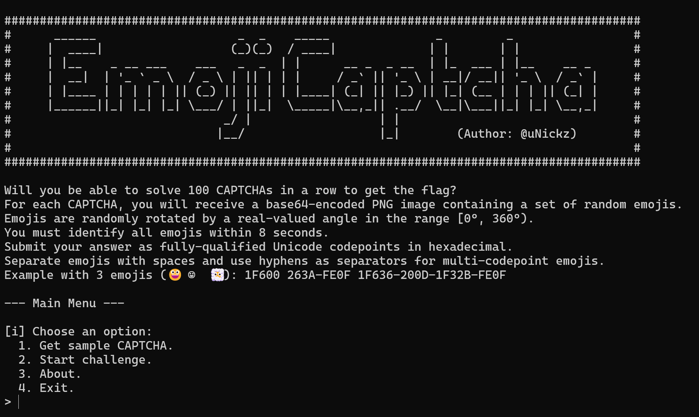
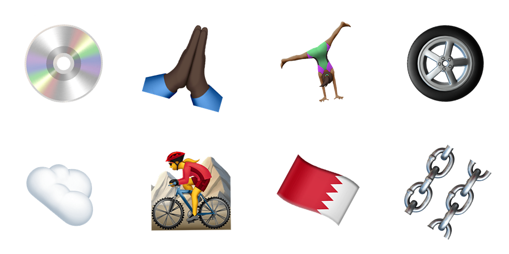
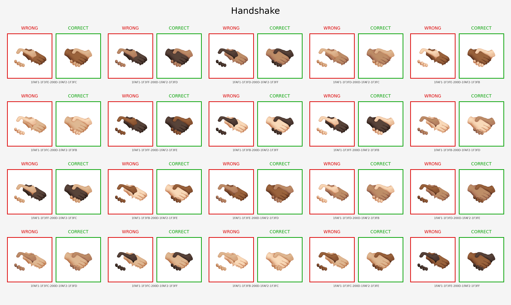
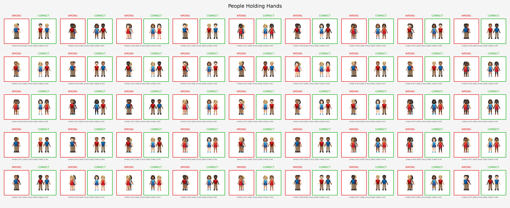
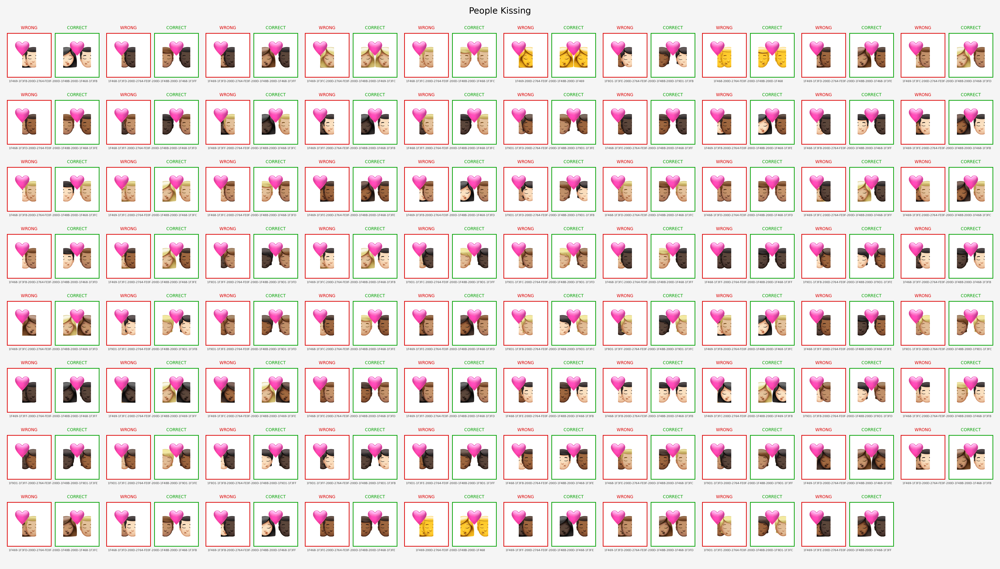
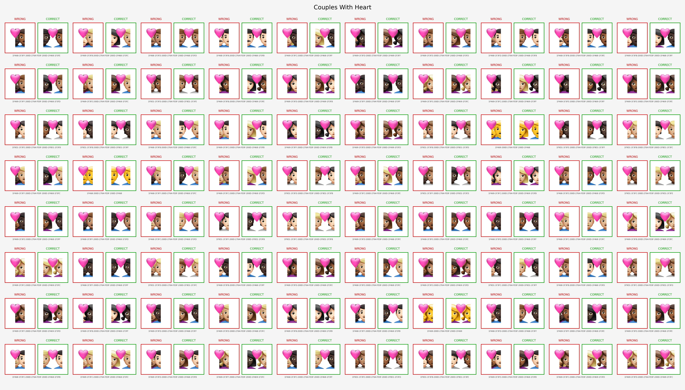
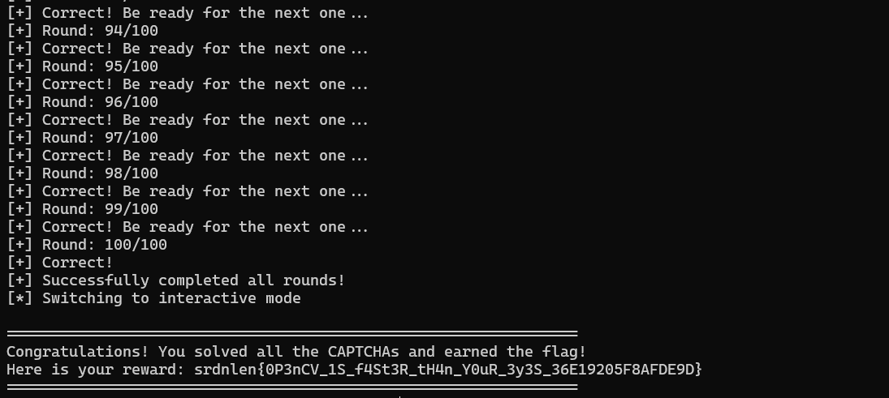

# Emoji CAPTCHA

**CTF:** Srdnlen CTF 2026 Quals

**Category:** Misc

**Difficulty:** Medium

**Solves:** 4

**Author:** [@uNickz](https://github.com/uNickz) (Nicholas Meli)

---

## Description

> CAPTCHAs were invented to keep robots out and let humans in. We decided to reverse the rules.
>
> This is a remote challenge, you can connect to the service with: `nc emoji.challs.srdnlen.it 1717`

---

## Overview



The goal of this challenge is to successfully solve **100 consecutive emoji-based CAPTCHAs**.

For each round, the server generates an image containing **8 distinct emojis**. The player has **at most 8 seconds** to identify all the emojis and submit their corresponding **Unicode codepoints**.

Each generated image follows a fixed layout:
 - The image contains **8 distinct fully-qualified emojis** arranged in a **4×2 grid**.
 - Every emoji occupies a **256×256 pixel square**.
 - Each emoji is **randomly rotated** by a real-valued angle in the range **[0°, 360°)**.
 - The image is rendered on a **white background**.

The expected submission format is:
 - **Uppercase hexadecimal Unicode codepoints**
 - **Space-separated emojis**
 - **Hyphen-separated codepoints** for multi-codepoint emojis

The challenge also provides the following resources:

- **Complete emoji list with Unicode codepoints**:
  https://unicode.org/Public/emoji/latest/emoji-test.txt

- **Font used by the server to render the emojis**:
  https://github.com/PoomSmart/EmojiLibrary/releases/download/0.18.4/AppleColorEmoji-160px.ttf

- Images are rendered server-side using the **Python PIL library** (`v12.1.1`).

A sample CAPTCHA is shown below:



The correct solution for this sample is:

```
1F4BF 1F64F-1F3FF 1F938-1F3FE-200D-2640-FE0F 1F6DE 2601-FE0F 1F6B5-200D-2640-FE0F 1F1E7-1F1ED 26D3-FE0F
```

---

### Server Emoji Rendering

By combining all the provided information, we can assume that the server renders images using code similar to the following:

```py
import random
from PIL import Image, ImageDraw, ImageFont


FONT_PATH = "AppleColorEmoji-160px.ttf"
FONT_SIZE = 160
FONT = ImageFont.truetype(FONT_PATH, FONT_SIZE, layout_engine=ImageFont.Layout.RAQM)


def create_emoji_box(emoji_char: str, font: ImageFont.ImageFont, size: int) -> Image.Image:
    box = Image.new("RGB", (size, size), BG_COLOR)

    temp_size = int(size * 1.5)
    temp_img = Image.new("RGBA", (temp_size, temp_size), (255, 255, 255, 0))
    draw_temp = ImageDraw.Draw(temp_img)

    bbox = draw_temp.textbbox((0, 0), emoji_char, font=font)
    text_w = bbox[2] - bbox[0]
    text_h = bbox[3] - bbox[1]
    x = (temp_size - text_w) // 2 - bbox[0]
    y = (temp_size - text_h) // 2 - bbox[1]

    draw_temp.text((x, y), emoji_char, font=font, embedded_color=True)
    angle = random.uniform(0, 360)
    temp_img = temp_img.rotate(angle, resample=Image.BICUBIC, expand=False)

    paste_x = (size - temp_size) // 2
    paste_y = (size - temp_size) // 2

    box.paste(temp_img, (paste_x, paste_y), temp_img)
    return box


emoji_char, emoji_code = "😀", "1F600"
box = create_emoji_box(emoji_char, FONT, BOX_SIZE)
box.save(f"{emoji_code}.png")
```

By interacting with the challenge server, it becomes apparent that **240 specific emojis** are rendered differently from their standard Apple emoji glyphs, producing visually _glitched_ variants compared to the expected rendering.

These emojis can be grouped into **four main categories**:

1. Handshake



> [!NOTE]
> The red box shows the emoji (_glitched_) as rendered by the challenge server, while the green box shows the standard Apple rendering.

---

2. People Holding Hands



> [!NOTE]
> The red box shows the emoji (_glitched_) as rendered by the challenge server, while the green box shows the standard Apple rendering.

---

3. People Kissing



> [!NOTE]
> The red box shows the emoji (_glitched_) as rendered by the challenge server, while the green box shows the standard Apple rendering.

---


4. Couples With Heart



> [!NOTE]
> The red box shows the emoji (_glitched_) as rendered by the challenge server, while the green box shows the standard Apple rendering.

---

This behavior is **intentional and not a server bug**.

The challenge was designed this way to prevent players from relying on **pre-existing emoji datasets**, such as:
- [https://github.com/iamcal/emoji-data](https://github.com/iamcal/emoji-data/tree/master/img-apple-160)

Additionally, this modification prevents the direct use of **pre-trained emoji recognition models or neural networks**, which are typically trained on standard emoji renderings.

As a result, players cannot simply rely on existing resources or off-the-shelf models. Instead, they must **recreate the server-side rendering pipeline and generate their own dataset**, ensuring that the generated images exactly match the visual appearance produced by the server.

---

## Exploitation

Solving the challenge manually is clearly infeasible: the service requires **100 consecutive CAPTCHA solves**, each with a **hard 8-second timeout**.

The key observation is that the CAPTCHA generation process is **completely deterministic** apart from the rotation applied to each emoji. Since the server provides both:

- The **exact font used for rendering**.
- The **complete list of valid emojis**.

We can reproduce the rendering pipeline locally and build a dataset that perfectly matches the server output.

---

### Solving Pipeline

At a high level, the CAPTCHA solver follows the pipeline below:
```
       Unicode emoji list
                │
                ▼
    Build local emoji dataset
                │
                ▼
Precompute emoji representations
       ├─ Color histograms
       └─ Template images
                │
                ▼
      Receive CAPTCHA image
                │
                ▼
     Split into 8 emoji boxes
                │
                ▼
  For each emoji box (parallelized):
    ├─ Histogram candidate filtering
    ├─ Coarse rotation search
    └─ Fine template matching
                │
                ▼
         Combine results
                │
                ▼
          Submit solution
```

---

### Building the Emoji Dataset

The first step is to generate a local dataset of all valid emojis using the same rendering configuration used by the server.

The challenge provides the official Unicode emoji list:
- https://unicode.org/Public/emoji/latest/emoji-test.txt

We parse this file and extract only **fully-qualified emojis**, ignoring entries introduced in newer Unicode versions that are not supported by the server font.

Each emoji is stored together with its expected **solution format** (hyphen-separated Unicode codepoints).
```py
def download_unicode_emoji_pool(url: str, save_path: str) -> list[dict[str, str]]:
    try:
        response = requests.get(url, timeout=10)
        response.raise_for_status()
        lines = response.text.splitlines()
    except requests.exceptions.RequestException as e:
        print(f"Error downloading emoji data: {e}")
        return []

    emoji_pool: list[dict[str, str]] = []
    for line in lines:
        line = line.strip()
        if not line or line.startswith("#") or "fully-qualified" not in line:
            continue

        if "E17.0" in line or "E18.0" in line:
            continue

        codepoints_str = line.split(";")[0].strip()
        hex_codes = codepoints_str.split()

        emoji_char = "".join(chr(int(h, 16)) for h in hex_codes)
        solution_format = "-".join(hex_codes)

        emoji_pool.append({"char": emoji_char, "solution": solution_format})

    with open(save_path, "w", encoding="utf-8") as f:
        json.dump(emoji_pool, f, ensure_ascii=False, indent=4)

    return emoji_pool
```

The resulting dataset contains a few thousand emojis (`3781` to be exact).

For each emoji we generate a **reference rendering** using the same font and text layout logic used by the challenge service.

---

### Precomputation

In order to solve each CAPTCHA quickly enough, most of the heavy computation must be performed **before connecting to the service**.

For each emoji in the dataset we compute two representations:
1. **Color histogram**.
2. **Template image**.

---

#### (Pre)Step 1: Color Histogram

The color histogram acts as a fast coarse filter.

Since the CAPTCHA background is always white, we first mask out the background and compute a **3D RGB histogram** (16 bins per channel).

```py
def get_color_histogram(img_bgr: np.ndarray) -> np.ndarray:
    gray = cv2.cvtColor(img_bgr, cv2.COLOR_BGR2GRAY)
    _, mask_inv = cv2.threshold(gray, 245, 255, cv2.THRESH_BINARY_INV)
    hist = cv2.calcHist([img_bgr], [0, 1, 2], mask_inv, [16, 16, 16], [0, 256, 0, 256, 0, 256])
    cv2.normalize(hist, hist, alpha=0, beta=1, norm_type=cv2.NORM_MINMAX)
    return hist.flatten()
```

This produces a **4096-dimensional feature vector** for each emoji.

The histograms are stored in a matrix so they can be compared quickly using vectorized NumPy operations.

---

#### (Pre)Step 2: Template Database

In addition to the histogram we store a **normalized template image** for each emoji.

To make template matching efficient at recognizing rotation and cropping artifacts, we:

1. Detect the bounding box of the emoji.
2. Crop the image.
3. Center it inside a fixed-size canvas.

```py
def align_and_crop(img_bgr: np.ndarray, canvas_size: int) -> np.ndarray:
    gray = cv2.cvtColor(img_bgr, cv2.COLOR_BGR2GRAY)
    _, thresh = cv2.threshold(gray, 250, 255, cv2.THRESH_BINARY_INV)
    coords = cv2.findNonZero(thresh)

    if coords is None:
        return np.full((canvas_size, canvas_size, 3), 255, dtype=np.uint8)

    x, y, w, h = cv2.boundingRect(coords)
    crop = img_bgr[y:y+h, x:x+w]

    canvas = np.full((canvas_size, canvas_size, 3), 255, dtype=np.uint8)
    if w > canvas_size or h > canvas_size:
        scale = canvas_size / max(w, h)
        new_w, new_h = int(w * scale), int(h * scale)
        crop = cv2.resize(crop, (new_w, new_h))
        w, h = new_w, new_h

    start_y = (canvas_size - h) // 2
    start_x = (canvas_size - w) // 2
    canvas[start_y:start_y+h, start_x:start_x+w] = crop
    return canvas
```

This normalization step significantly improves matching stability.

All templates are stored in memory so they can be accessed instantly during solving.

---

#### Step 3: Candidate Filtering

For each emoji box we compute the histogram and compare it with all dataset histograms.

We then select only the **top-k closest candidates**.
```py
target_hist = get_color_histogram(target_box)
diffs = np.sum((hist_matrix - target_hist) ** 2, axis=1)
top_indices = np.argsort(diffs)[:top_k_color]
```

This step reduces the search space from **thousands of emojis to roughly a dozen candidates**.

---

#### Step 4: Coarse Rotation Search

The remaining ambiguity is the **unknown rotation** applied by the server.

To estimate it efficiently we perform a coarse search over angles with a **10° step**.

For each candidate emoji we rotate the target image and run **template matching** using OpenCV:
```py
target_padded = align_and_crop(target_box, 350)

rotated_targets: dict[int, np.ndarray] = {}
for angle in range(0, 360, coarse_step):
    rot = rotate_image_cv2(target_padded, angle)
    rotated_targets[angle] = align_and_crop(rot, 260)

coarse_results: list[tuple[float, int, int, np.ndarray]] = []
for idx in top_indices:
    template = db_templates[idx]
    best_c_err = float("inf")
    best_c_ang = 0

    for angle, rot_target in rotated_targets.items():
        res = cv2.matchTemplate(rot_target, template, cv2.TM_SQDIFF_NORMED)
        min_val = np.min(res)
        if min_val < best_c_err:
            best_c_err = min_val
            best_c_ang = angle

    coarse_results.append((best_c_err, best_c_ang, idx, template))

coarse_results.sort(key=lambda x: x[0])
top_2_coarse = coarse_results[:2]
```

The candidates with the lowest matching error are kept for the next phase.

---

#### Step 5: Fine Rotation Search

Finally we refine the rotation around the best rough estimate by checking all nearby angles.

```py
global_min_error = float("inf")
best_match_code: str | None = None

for coarse_err, coarse_ang, idx, template in top_2_coarse:
    candidate_code = solutions[idx]
    for offset in range(-(coarse_step-1), coarse_step):
        angle = (coarse_ang + offset) % 360
        if angle in rotated_targets:
            rot_target = rotated_targets[angle]
        else:
            rot = rotate_image_cv2(target_padded, angle)
            rot_target = align_and_crop(rot, 260)

        res = cv2.matchTemplate(rot_target, template, cv2.TM_SQDIFF_NORMED)
        min_val = np.min(res)

        if min_val < global_min_error:
            global_min_error = min_val
            best_match_code = candidate_code
```

This produces the final best match for the emoji.

The candidate with the **lowest template matching error** is selected as the solution.

---

### Step 6: Parallelization

Each CAPTCHA contains **8 independent recognition tasks**, making the problem easily parallelizable.

We therefore process all emoji boxes using a `ThreadPoolExecutor`:
```py
tasks: list[tuple[int, np.ndarray, list[str], np.ndarray, list[np.ndarray], int, int]] = []
idx = 1
for row in range(rows):
    for col in range(cols):
        x_start = col * box_size
        y_start = row * box_size
        target_box = captcha_img[y_start:y_start+box_size, x_start:x_start+box_size]

        tasks.append((idx, target_box, solutions_list, hist_matrix, db_templates, 12, 10))
        idx += 1

results: list[tuple[int, str | None]] = []
with ThreadPoolExecutor(max_workers=workers) as executor:
    for res in executor.map(_process_single_box, tasks):
        results.append(res)

results.sort(key=lambda x: x[0])
answer = " ".join(code for _, code in results)
```

This significantly reduces the total solving time and ensures that each CAPTCHA can be processed well within the **8-second limit**.

---

### Final Exploit Script

The full exploit consists of two components:

* [`solve.py`](checker/solve.py) -> emoji recognition engine.
* [`checker.py`](checker/checker.py) -> remote interaction script.

---

## Flag

Once all rounds are completed, the service returns the flag.



```
srdnlen{0P3nCV_1S_f4St3R_tH4n_Y0uR_3y3S_36E19205F8AFDE9D}
```
