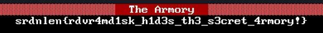

# The Trilogy of Death Vol 2: The Legendary Armory

**Author:** @davezero (Davide Maiorca)
**CTF:** Srdnlen CTF 2026 Quals
**Category:** Misc
**Difficulty:** Medium
**Solves:** 39

## Description

> The Trilogy of Death - Chapter II - The Legendary Armory
\
[Attachments](https://unicadrsi-my.sharepoint.com/:f:/g/personal/davide_maiorca_unica_it1/IgDHAgOd5EInSYhD8XGzAWD8Ac9G7NI-i-6FZELljDHejio?e=G8GO5k)
\
"He kept his weapons in rooms of fleeting air."
\
He learned from the fall of kingdoms: trust nothing that persists. His second sanctuary existed only in volatile memory - alive while the power held, gone at the flick of a switch. Someone captured a snapshot of that mind before the lights went out. Somewhere in that frozen moment, the armory still burns.
The armourer hid his weapons in rooms of fleeting air,
his forge still burns inside the mind - if you know how to stare.
Two relics guard his greatest work, asleep in volatile stone,
when the right time comes, remember to XOR, and claim what can be known.
\
The Trilogy of Death follows the digital ghost of a legendary hacker known only as The Armourer - a figure who lived and died by obsolete machines, leaving fragments of his secrets scattered across three machines. Are you able to unveil their secrets?
\
The Trilogy of Death is composed of three forensics challenges of increasing difficulty. The three challenges are completely independent and can be solved separately (i.e., you can solve chapter 3 without solving the other two). 
\
I hope you will enjoy the lore and the ideas behind the challenges, which will deeply challenge your forensics knowledge and skills!

## Solution

You get a memory dump of an image built with Windows 98 and 86box (fun fact: I used 3dfx voodoo cards as the original idea was different, but got stuck in a rabbit hole and decided to change it completely :) ).

Since I imagined most people would try to slop it with AI, I intentionally left hidden two fake flags:

1. One was a base64 string 
2. The other one was in an armory.bmp string I intentionally used my horrible handwriting to make it less interpretable by AI. Apparently, it worked, since many players failed to retrieve the file and get non-existent flags from random signs :P.

The rest of the flow is straightforward:

1. Understanding that config.sys and autoexec.bat are the most important config files in Windows 98. When you analyze a win image or dump, you should always check them.
2. You can easily spot these files as their content usually start with device=
3. Noticing that there was RAMDRIVE.SYS used. That is a ramdisk, a very nice trick that allows you to store entire files in RAM without risking any corruption. The ramdisk was 4 Mbytes (4096 long.
4. Finding the magic number of the RAMDRIVE. That was interesting, since there are many implementations of ramdrive, and I used the RDV 1.20 (less known, less dos :D) 
5. Dumping the ramdrive (4MB from RDV)
6. I intentionally corrupted the structure of the ramdisk so that sleuthkit would die: offsets 0xb and 0xc from the header, corresponding to the bytes per sectors, were replaced with 0x00 (should be 0x200 - 512); offsets 0x13 and 0x14 corresponded to the number of sectors (4096KB * 1024 / 512 - > 8192) and were replaced as well with 0x0000.
7. Fixing the offsets, then using istat and then icat (sleuth kit) to parse the ramdisk
8. You would find two files, T and K. T is xored with the repeated key K
9. You get a zip file with ZZT, a popular ASCII-based game from the end of the 80s.
10. Play the game! (Or use the ZZT editor levels) in Town.ZZT. Enter the armory and get the flag.

